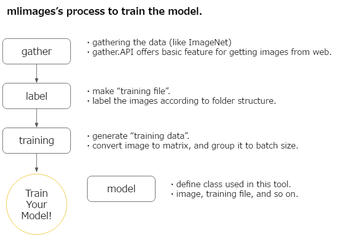
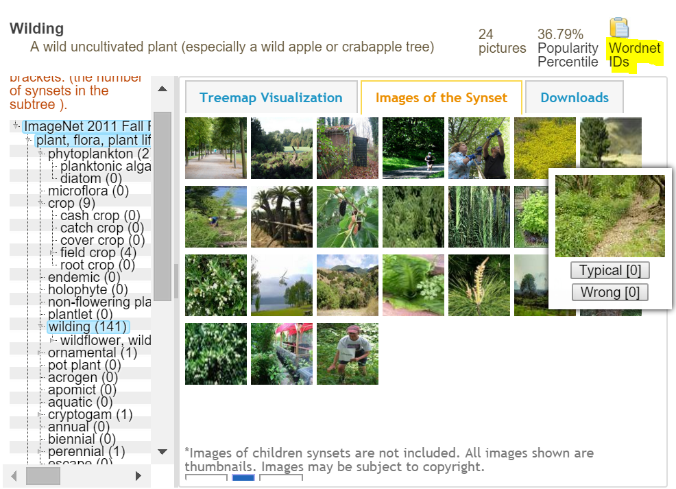

# mlimages

gather and create image dataset for machine learning.




## How to use

```
pip install mlimages
```

**This tool dependes on Python 3.5**

(but it works quickly because of async/await feature)


## Gather Images

Please make python file in your project folder as below.

```py
import mlimages.scripts.gather_command as cmd

if __name__ == "__main__":
    ps = cmd.make_parser()
    args = ps.parse_args()
    cmd.main(args)
```

### Imagenet

Confirm the **WordnetID** on the [ImageNet site](http://image-net.org/synset)



Then download it.

```
python your_script_file.py -p path/to/data/folder -imagenet --wnid n11531193
```

## Labeling

You can create training data from images data folder.

Please make python file in your project folder as below.

```py
import mlimages.scripts.label_command as cmd

if __name__ == "__main__":
    ps = cmd.make_parser()
    args = ps.parse_args()
    cmd.main(args)
```

Then run it.

```
python label.py path/to/images/folder --out path/to/training_data.txt
```

## Training

Now, you have images and training_data.txt.
But you have to do some pre-processing to train your model. For example...

* resize image
* normalize image
* sometimes change color...

:sob:

Don't warry. mlimages supports you!


```py
from mlimages.model import LabelFile, ImageProperty


lf = LabelFile("path/to/training_data.txt", img_root="path_to_your_image_folder")
prop = ImageProperty(width=32, gray_scale=True)

td = lf.to_training_data(prop)
td.make_mean_image("path/to/mean_image")  # store mean image to normalize

for d in td.generate():
    # d is numpy array that adjusted according to ImageProperty, and normalized by mean_image!
    # only you have to do is train the model by it!
    print(d)

```

And also, you can restore the image from data.

```py
image = td.result_to_image(numpy_array, label)
```
